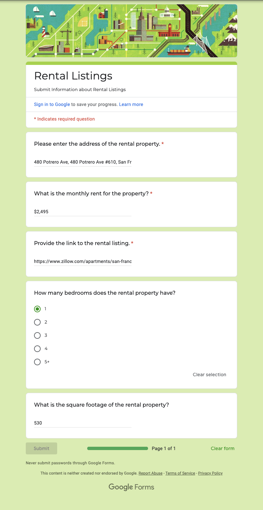

# Rent Finder - Web Scraper

**This Python script automates the extraction of rental listings from Zillow and submits the data to a Google Form.
The script operates on a copy of the website provided for testing purposes.**

## Features
- Web Scraping: Uses BeautifulSoup to parse HTML content from Zillow’s rental listings.
- Web Automation: Uses Selenium WebDriver to automate interactions with the website.
- Data Submission: Automatically populates and submits a Google Form with the extracted rental information, which is then recorded in a Google Sheets worksheet.

## Visuals
This script streamlines the process of gathering rental data and efficiently transferring it to a Google Sheets for easy management and analysis.

<table>
<tr>
<td>
<td></td>
</tr>
</table>
